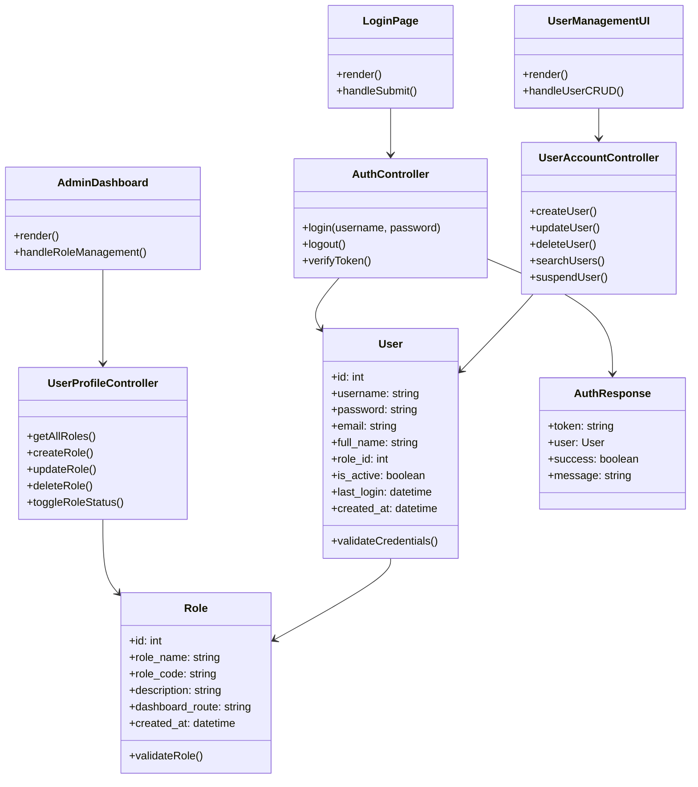
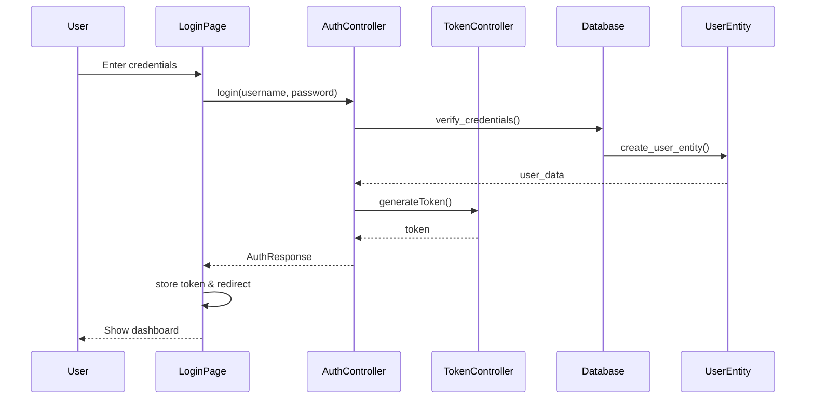
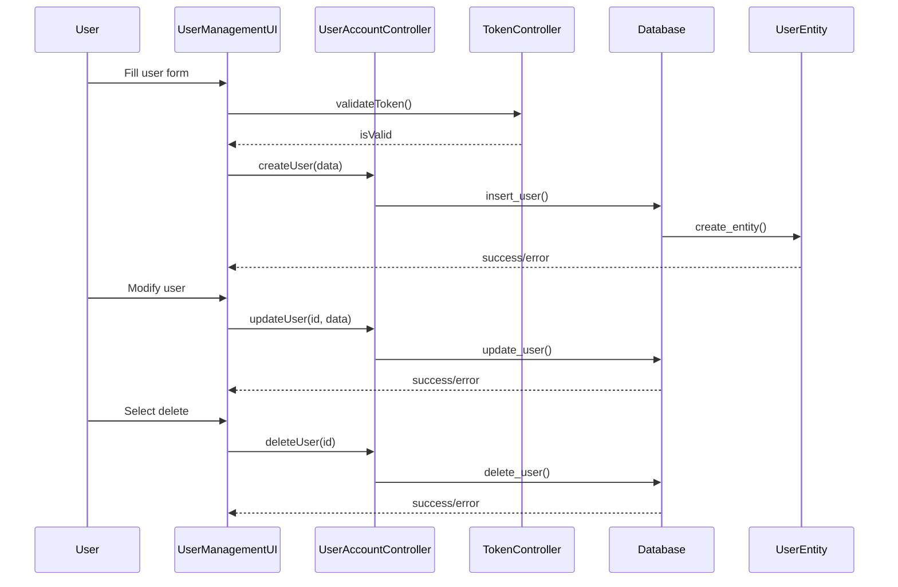
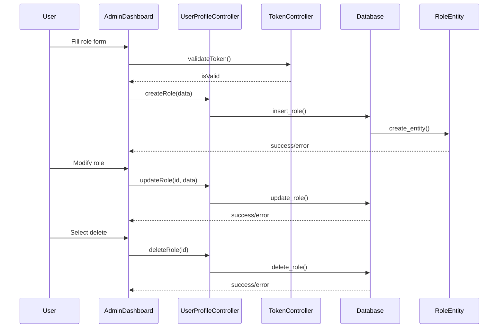

# BCE Pattern Analysis and Diagrams

## Table of Contents
1. [Code Structure Analysis](#code-structure-analysis)
2. [BCE Pattern Evaluation](#bce-pattern-evaluation)
3. [Class Diagrams](#class-diagrams)
4. [Sequence Diagrams](#sequence-diagrams)
5. [Recommendations](#recommendations)

## Code Structure Analysis

### 1. Boundary Layer
Frontend React/Next.js components in `src/app/src/app/dashboard/`:
- `admin/page.jsx` - User interface for role management
- `csr/page.jsx` - CSR interface
- `pin/page.jsx` - PIN interface
- `platform/page.jsx` - Platform management interface

### 2. Control Layer
```
src/controller/
├── auth_controller.py
├── user_profile_controller.py
├── view_user_account_controller.py
├── update_user_account_controller.py
├── suspend_user_account_controller.py
├── search_user_account_controller.py
├── logout_controller.py
├── login_controller.py
├── create_user_account_controller.py

src/app/src/controllers/
├── auth/
│   ├── sessionController.js
│   └── tokenController.js
├── userProfile/
│   └── userProfileController.js
├── user/
│   ├── updateUserController.js
│   └── viewUserController.js
```

### 3. Entity Layer
```
src/entity/
├── auth_response.py
├── role.py
├── user.py
```

## BCE Pattern Evaluation

### 1. Boundary Layer (✅ Good)
- Clear separation of UI components
- Proper routing structure
- Form handling and validation
- API data presentation

### 2. Control Layer (✅ Good)
- Well-organized controllers for specific functions
- Clear separation of concerns:
  - Authentication control
  - User profile management
  - Account management
- Both frontend and backend controllers follow consistent patterns

### 3. Entity Layer (⚠️ Could be improved)
- Basic entity definitions exist
- Could benefit from:
  - More comprehensive entity relationships
  - Data validation at entity level
  - Business rule encapsulation

## Class Diagrams

### BCE Class Diagram


## Sequence Diagrams

### 1. Login Sequence


### 2. User Account Management Sequence


### 3. Role Management Sequence


## Recommendations

### 1. Entity Layer Enhancements
- Add more business logic to entities
- Implement validation methods in entity classes
- Add relationship methods between entities

### 2. Control Layer Improvements
- Add more error handling and validation
- Implement transaction management
- Add logging and monitoring

### 3. Boundary Layer Refinements
- Add more input validation
- Improve error message handling
- Implement better loading states

### 4. General Improvements
- Add more comprehensive documentation
- Implement unit tests for each layer
- Add data transfer objects (DTOs)
- Implement caching strategies