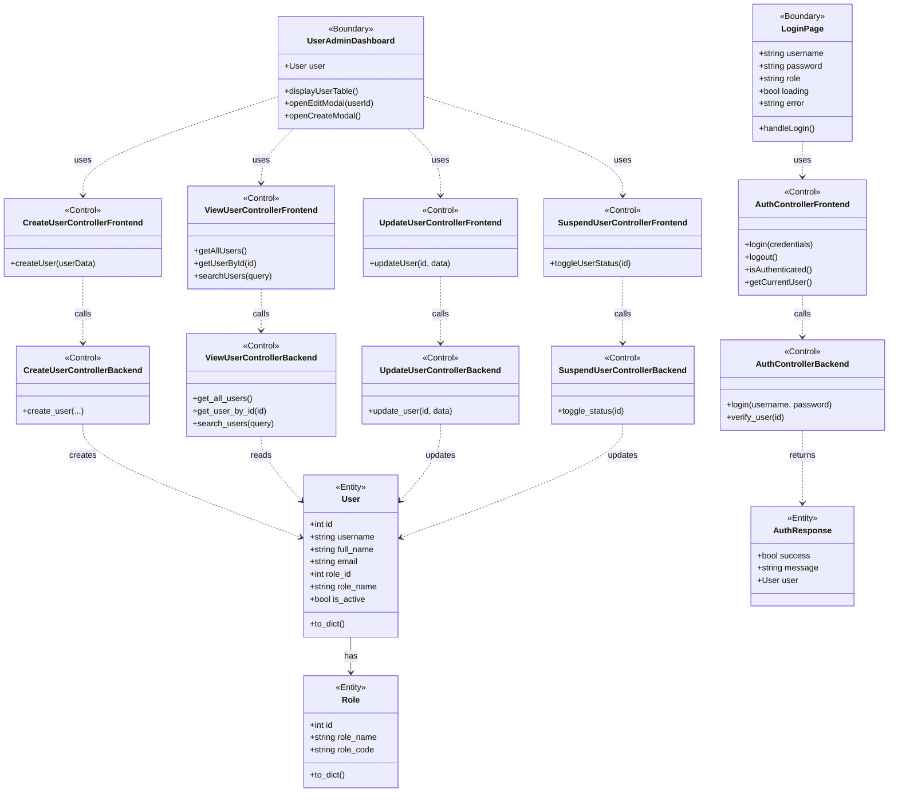

# BCE Class Diagram & Sequence Diagrams (Updated)

This document contains the updated BCE Class Diagram and the sequence diagrams for the main user functions implemented in the codebase.

## BCE Class Diagram (Mermaid)

## Sequence Diagrams (Mermaid)

### 1) User Login

### 2) User Logout

### 3) Create User (User Admin)

### 4) View User Account (User Admin)

### 5) Update User Account (User Admin)

### 6) Suspend / Activate User Account (User Admin)

### 7) Search User Account (User Admin)

---

### Notes & Mappings

- Boundary components: `LoginPage`, `UserAdminDashboard` (React/Next.js pages and modals)
- Frontend controllers: located under `src/app/src/controllers/*`
- Backend controllers: located under `src/controller/*.py`
- Entities: `src/entity/*.py` (`User`, `Role`, `AuthResponse`)
- Database access: Supabase client in backend controllers

This set of diagrams maps directly to the files in the repository. If you'd like, I can:

- write these diagrams into the other diagrams file (`CRUD_USER_ACCOUNTS_DIAGRAMS.md`) or split them into separate files per use case
- generate PNG/SVG exports of the Mermaid diagrams
- add/update a README section that references these diagrams and points to the corresponding files in the repo

13. **Navigation** → Redirect to dashboard

### **Logout Flow:**
1. **User Click** → UserAdminDashboard (Boundary)
2. **Confirmation** → Show modal
3. **Confirm Action** → AuthController.logout() (Frontend Control)
4. **Remove Data** → Delete from localStorage
5. **Navigation** → Redirect to login page

**Note**: Logout is entirely client-side! No backend API call or database update needed because authentication is stateless.

---

## Key Design Patterns

1. **Singleton Pattern**: AuthController instances are singletons (one instance per app)
2. **Factory Pattern**: `User.from_db()` creates User entities from database data
3. **Repository Pattern**: Supabase client abstracts database operations
4. **MVC/BCE Pattern**: Separation of Boundary, Control, and Entity layers
5. **Stateless Authentication**: No server-side sessions; user data in localStorage

---

## Security Considerations

1. **Password Hashing**: Passwords stored as bcrypt hashes in database
2. **HTTPS**: All API communication should use HTTPS in production
4. **Input Validation**: Username and password validated before database query
5. **Account Suspension**: `is_active` flag prevents suspended users from logging in
6. **No Password in Response**: User password never returned to frontend

---

## Testing Points

### **Unit Tests:**
- AuthController.login() with valid credentials
- AuthController.login() with invalid credentials
- AuthController.login() with suspended account
- AuthController.logout() clears localStorage
- User.from_db() creates correct entity
- User.to_dict() serializes correctly

### **Integration Tests:**
- POST /api/login with valid user returns 200
- POST /api/login with invalid user returns 200 with success=false
- POST /api/login updates last_login in database
- GET /api/verify/{user_id} returns correct status

### **E2E Tests:**
- User can login with correct credentials
- User redirected to correct dashboard based on role
- User cannot login with incorrect password
- Suspended user cannot login
- User can logout successfully
- After logout, user redirected to login page

---

**End of BCE Class Diagram Documentation**
