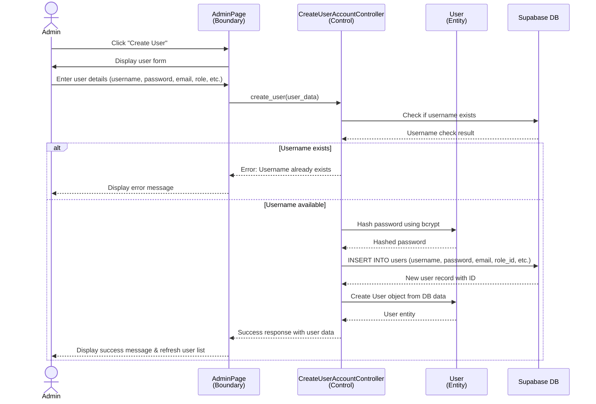
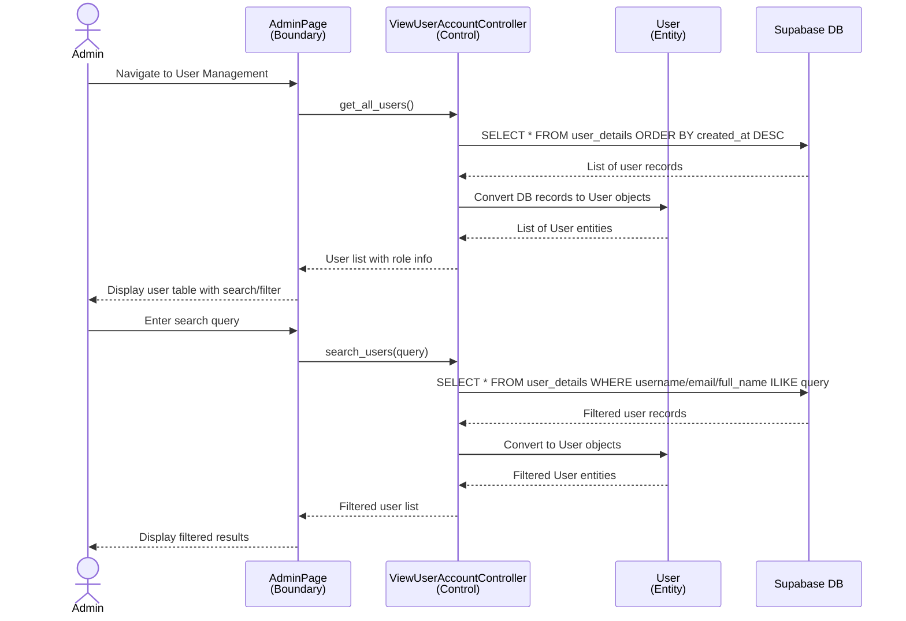
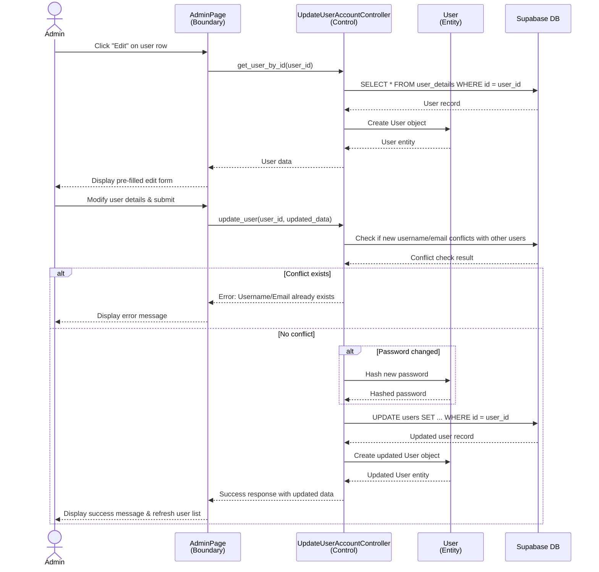
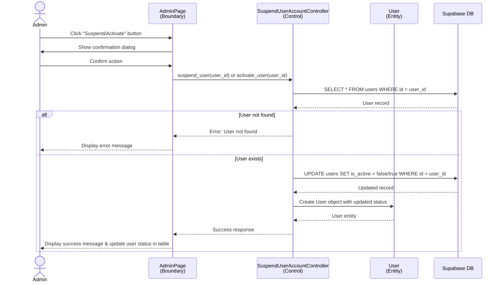
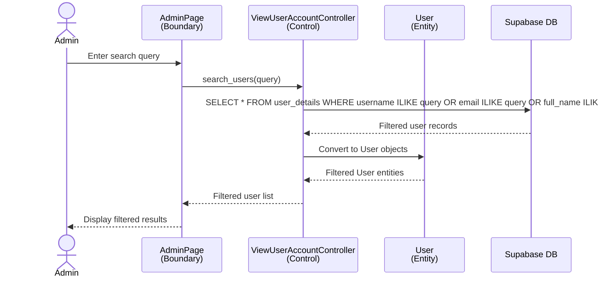
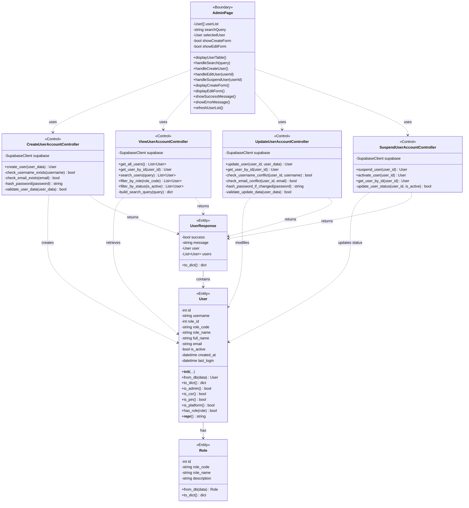
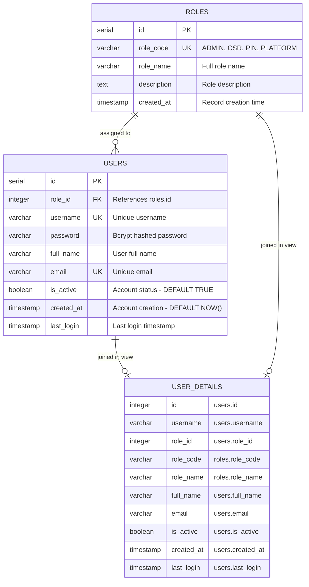
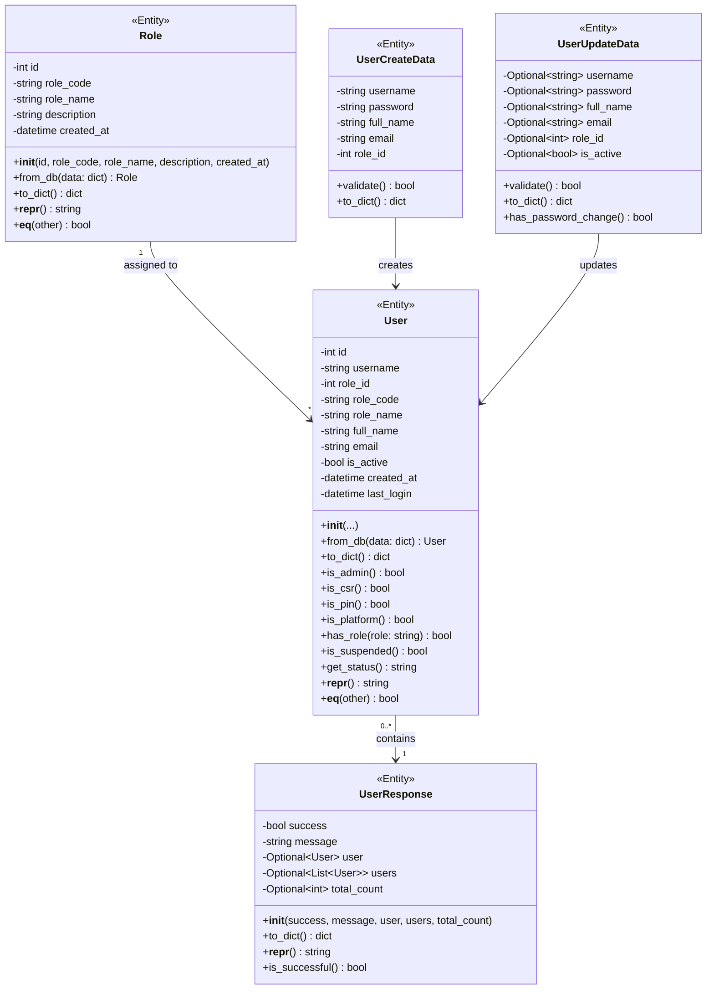
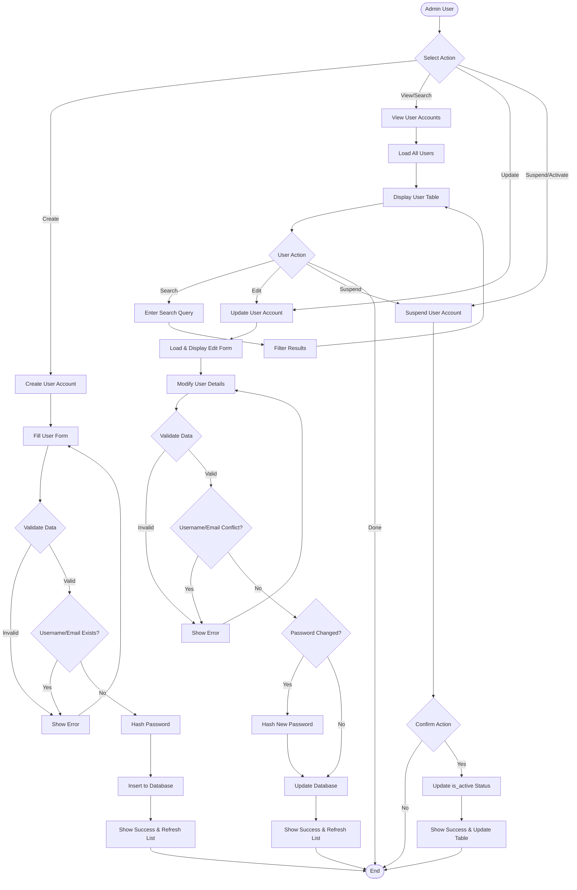

# CRUD User Accounts System Diagrams

## 1. Sequence Diagram - Create User Account



## 2. Sequence Diagram - View User Accounts



## 3. Sequence Diagram - Update User Account



## 4. Sequence Diagram - Suspend User Account



## 5. Sequence Diagram - Search User Account



## Notes

- The sequence diagrams above match the BCE class diagram in `BCE_CLASS_DIAGRAM_LOGIN_LOGOUT.md`.
- Use these diagrams as a reference when implementing, testing, or documenting the user management flows.


## 5. BCE Class Diagram - User Account Management



## 6. Database Conceptual Schema - User Management



## 7. Entity Class Diagram - User Account Entities



## 8. Complete CRUD Operations Flow



## 9. Key Features and Business Rules

### Create User Account
- **Validation Rules**:
  - Username: 3-50 characters, alphanumeric + underscore
  - Password: Minimum 8 characters
  - Email: Valid email format, unique
  - Role: Must be valid role_id from roles table
  - Full name: Required, 2-100 characters

- **Business Logic**:
  - Check username uniqueness before creation
  - Check email uniqueness before creation
  - Hash password using bcrypt (cost factor: 12)
  - Set is_active = true by default
  - Set created_at = NOW()
  - All fields except last_login are required

### View User Accounts
- **Features**:
  - Display all users with role information
  - Sort by created_at (newest first)
  - Search across username, email, full_name (case-insensitive)
  - Filter by role (ADMIN, CSR, PIN, PLATFORM)
  - Filter by status (Active/Suspended)
  - Display user status badge (Active/Suspended)

- **Search Logic**:
  - Multi-field search using ILIKE
  - Searches: username, email, full_name, role_name
  - Empty query returns all users
  - Results update in real-time

### Update User Account
- **Updatable Fields**:
  - Username (must remain unique)
  - Password (optional - only if changed)
  - Full name
  - Email (must remain unique)
  - Role (role_id)

- **Validation Rules**:
  - Cannot update to existing username (except own)
  - Cannot update to existing email (except own)
  - Password hash only if password field is provided
  - Must maintain at least one ADMIN user
  - Cannot change own role if only admin

### Suspend User Account
- **Suspend Logic**:
  - Set is_active = false
  - User cannot log in when suspended
  - Login returns "Account suspended" error
  - All user data preserved
  - Can be reactivated later

- **Activate Logic**:
  - Set is_active = true
  - User can log in again
  - Previous data and permissions restored

- **Business Rules**:
  - Cannot suspend own account
  - Must maintain at least one active ADMIN
  - Confirmation required before suspend/activate
  - Audit log of status changes (future enhancement)

## 10. Security Considerations

### Password Security
- Bcrypt hashing with salt (cost factor: 12)
- Plain text passwords never stored
- Password not returned in API responses
- Password only hashed on create/update if provided

### Access Control
- Only ADMIN role can perform CRUD operations
- JWT token required for all endpoints
- Token contains user_id and role_code
- Endpoints protected with `get_current_admin_user` dependency

### Data Validation
- Server-side validation for all inputs
- SQL injection prevention (parameterized queries)
- XSS prevention (input sanitization)
- CSRF protection (token-based auth)

### Error Handling
- User-friendly error messages
- No sensitive data in error responses
- Database errors logged server-side
- Unique constraint violations caught and handled

---

## How to View These Diagrams

### ✅ Best Option: GitHub
Push this file to your repository - GitHub automatically renders Mermaid diagrams beautifully!

### 📋 VS Code Extension
Install "Markdown Preview Mermaid Support" and press `Ctrl+Shift+V` to preview.

### 🌐 Online Viewer
Copy Mermaid code blocks to https://mermaid.live

### 📦 Export as Images
Use Mermaid CLI:
```bash
npm install -g @mermaid-js/mermaid-cli
mmdc -i CRUD_USER_ACCOUNTS_DIAGRAMS.md -o crud_diagrams.pdf
```
