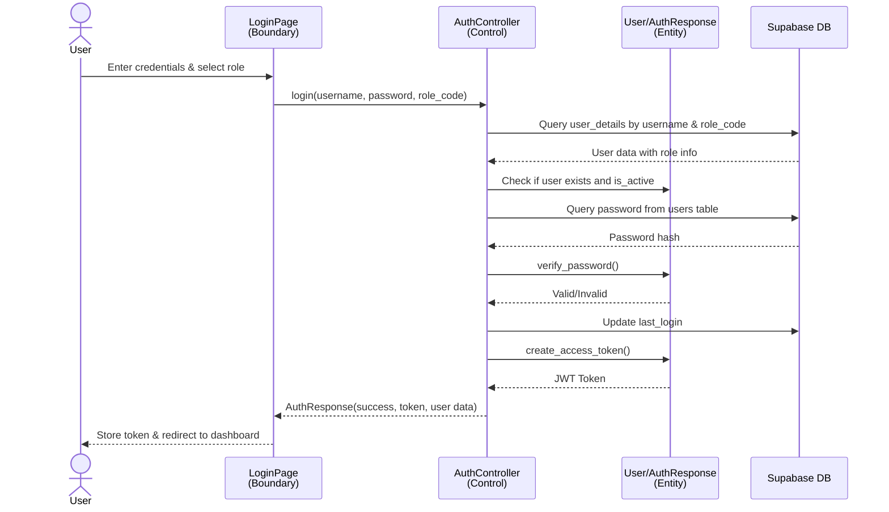
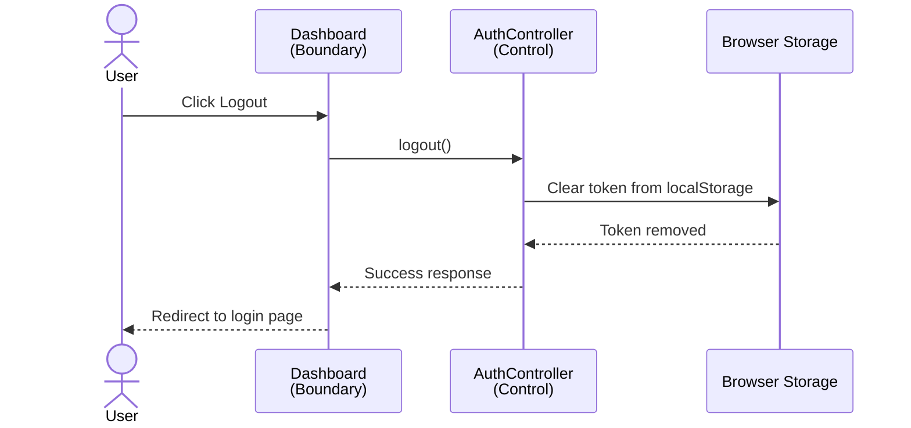
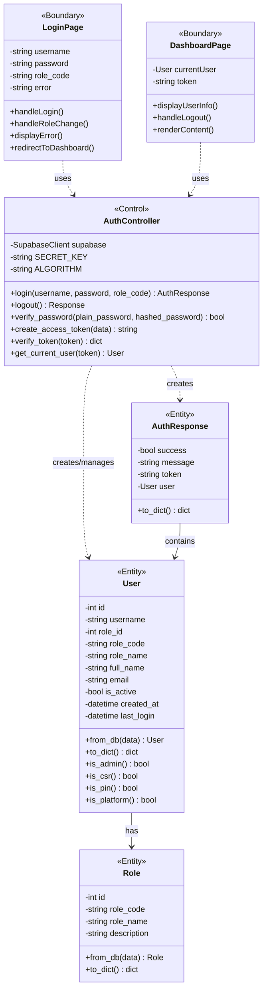
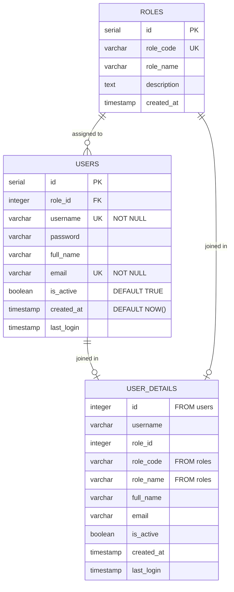
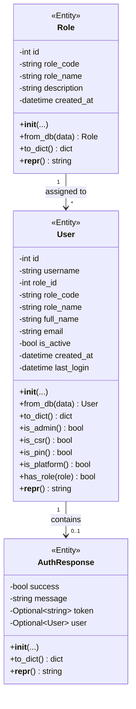

# Login and Logout System Diagrams

## 1. Sequence Diagram - Login



## 2. Sequence Diagram - Logout



## 3. BCE Class Diagram



## 4. Database Conceptual Schema (ER Diagram)



## 5. Entity Class Diagram



## 6. Key Design Patterns and Principles

### BCE (Boundary-Control-Entity) Pattern
- **Boundary**: LoginPage, DashboardPage (UI components)
- **Control**: AuthController (business logic)
- **Entity**: User, Role, AuthResponse (data models)

### Security Features
1. **Password Hashing**: Bcrypt with salt
2. **JWT Tokens**: Secure token-based authentication
3. **Role-Based Access**: Login validates role_code
4. **Active Status Check**: Suspended users cannot log in

### Database Design
- **Normalization**: Separate roles and users tables (3NF)
- **View**: user_details for efficient querying
- **Indexes**: username, email (unique), role_id (foreign key)
- **Constraints**: NOT NULL, UNIQUE, DEFAULT values

### Authentication Flow
1. User submits credentials with role selection
2. Backend queries user_details view (username + role_code)
3. Validates password hash using bcrypt
4. Checks if user is_active
5. Updates last_login timestamp
6. Generates JWT token with user claims
7. Returns AuthResponse with token and user data
8. Frontend stores token in localStorage
9. Token used for subsequent authenticated requests

### Logout Flow
1. User clicks logout button
2. Frontend calls logout function
3. Token removed from localStorage
4. User redirected to login page
5. No server-side session invalidation (stateless JWT)

---

## How to View These Diagrams

### Option 1: GitHub (Best)
- Push this file to your GitHub repository
- GitHub automatically renders Mermaid diagrams in `.md` files
- View directly on GitHub web interface

### Option 2: VS Code with Mermaid Extension
1. Install "Markdown Preview Mermaid Support" extension
2. Open this file in VS Code
3. Press `Ctrl+Shift+V` to preview

### Option 3: Online Mermaid Editor
- Copy the Mermaid code blocks
- Paste into https://mermaid.live
- View and export diagrams

### Option 4: Mermaid CLI
```bash
npm install -g @mermaid-js/mermaid-cli
mmdc -i LOGIN_LOGOUT_DIAGRAMS.md -o diagrams.pdf
```
