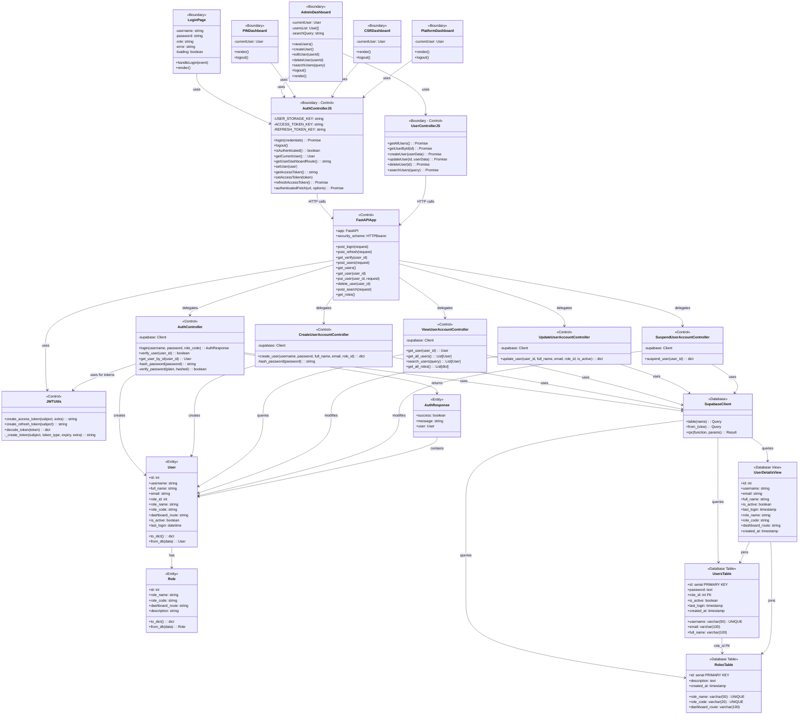

# BCE Class Diagram - CSR System

## Overview
The CSR System follows the **Boundary-Control-Entity (BCE)** architectural pattern, providing clear separation of concerns across three distinct layers.

## Complete System Architecture



---

## Layer Descriptions

### 🎨 Boundary Layer (Frontend)

**Purpose**: User interface and user interaction

**Components**:
- **Pages**: LoginPage, AdminDashboard, PINDashboard, CSRDashboard, PlatformDashboard
- **Frontend Controllers**: AuthControllerJS, UserControllerJS

**Responsibilities**:
- Render UI components
- Capture user input
- Display data
- Make API calls
- Manage client-side state (localStorage)
- Handle routing and navigation

**Technologies**: Next.js 14, React, Tailwind CSS, JavaScript

---

### ⚙️ Control Layer (Backend)

**Purpose**: Business logic and request processing

**Components**:
- **FastAPI Application**: Main API entry point, routing, middleware
- **Controllers**: AuthController, CreateUserAccountController, ViewUserAccountController, UpdateUserAccountController, SuspendUserAccountController
- **Utilities**: JWTUtils

**Responsibilities**:
- Process HTTP requests
- Validate input data
- Enforce business rules
- Manage authentication and authorization
- Coordinate between boundary and entity layers
- Generate JWT tokens
- Handle password hashing

**Technologies**: Python 3.10+, FastAPI, Uvicorn, bcrypt, PyJWT

---

### 💾 Entity Layer (Data Models)

**Purpose**: Data representation and persistence

**Components**:
- **Entity Models**: User, Role, AuthResponse
- **Database**: Supabase PostgreSQL
- **Tables**: users, roles
- **Views**: user_details

**Responsibilities**:
- Define data structures
- Encapsulate business objects
- Provide data conversion methods (to_dict, from_db)
- Represent database schema
- Ensure data integrity through constraints

**Technologies**: Supabase (PostgreSQL), Pydantic models

---

## Key Design Patterns

### 1. Separation of Concerns
Each layer has distinct responsibilities and doesn't directly depend on implementation details of other layers.

### 2. Dependency Flow
```
Boundary → Control → Entity
```
Dependencies flow in one direction, maintaining clean architecture.

### 3. Entity Independence
Entity classes are pure data models with no dependencies on other layers.

### 4. Control Layer Mediation
All business logic is centralized in control layer controllers, making it easy to modify without affecting UI or data structures.

### 5. View Pattern (Database)
The `user_details` view pre-joins user and role data, simplifying queries and improving performance.

---

## Authentication Flow (BCE Mapping)

```
User Input (Boundary) 
    ↓
LoginPage.handleLogin() (Boundary)
    ↓
AuthControllerJS.login() (Boundary-Control)
    ↓
FastAPIApp.post_login() (Control)
    ↓
AuthController.login() (Control)
    ↓
SupabaseClient.query() (Control → Database)
    ↓
UserDetailsView (Database)
    ↓
User.from_db() (Entity)
    ↓
JWTUtils.create_tokens() (Control)
    ↓
AuthResponse (Entity)
    ↓
Return to Frontend (Boundary)
```

---

## CRUD Operations (BCE Mapping)

### Create User
```
AdminDashboard (Boundary)
    → UserControllerJS (Boundary-Control)
    → FastAPIApp (Control)
    → CreateUserAccountController (Control)
    → SupabaseClient (Database)
    → UsersTable (Database)
    → User (Entity)
```

### Read User
```
AdminDashboard (Boundary)
    → UserControllerJS (Boundary-Control)
    → FastAPIApp (Control)
    → ViewUserAccountController (Control)
    → SupabaseClient (Database)
    → UserDetailsView (Database)
    → User (Entity)
```

### Update User
```
AdminDashboard (Boundary)
    → UserControllerJS (Boundary-Control)
    → FastAPIApp (Control)
    → UpdateUserAccountController (Control)
    → SupabaseClient (Database)
    → UsersTable (Database)
```

### Delete (Suspend) User
```
AdminDashboard (Boundary)
    → UserControllerJS (Boundary-Control)
    → FastAPIApp (Control)
    → SuspendUserAccountController (Control)
    → SupabaseClient (Database)
    → UsersTable (Database)
```

---

## Security Mechanisms

### Password Security
- **Hashing**: bcrypt with salt
- **Storage**: Only hashed passwords stored
- **Verification**: Secure comparison using bcrypt.checkpw()

### Authentication
- **JWT Tokens**: Stateless authentication
- **Access Token**: Short-lived (60 minutes)
- **Refresh Token**: Longer-lived for token renewal
- **Claims**: User ID and role embedded in token

### Authorization
- **Role-Based Access Control (RBAC)**: Each endpoint checks user role
- **Token Validation**: Every protected endpoint validates JWT
- **Route Protection**: User Admin role required for user management

---

## Data Flow Example: User Login

1. **Boundary**: User enters credentials in LoginPage
2. **Boundary**: LoginPage calls AuthControllerJS.login()
3. **Boundary→Control**: AuthControllerJS sends POST /api/login
4. **Control**: FastAPIApp receives request
5. **Control**: FastAPIApp calls AuthController.login()
6. **Control→Entity**: AuthController queries database for user
7. **Entity**: User entity created from database row
8. **Control**: AuthController verifies password (bcrypt)
9. **Control**: AuthController generates JWT tokens (JWTUtils)
10. **Control**: AuthController creates AuthResponse entity
11. **Control→Boundary**: FastAPI returns response with tokens
12. **Boundary**: AuthControllerJS stores tokens in localStorage
13. **Boundary**: LoginPage redirects to role-specific dashboard

---

## Benefits of BCE Architecture

### Maintainability
- Changes to UI don't affect business logic
- Business rules centralized in controllers
- Database schema changes isolated to entity layer

### Testability
- Each layer can be tested independently
- Mock objects easily created for interfaces
- Clear boundaries for unit and integration tests

### Scalability
- Frontend and backend can scale independently
- Stateless JWT enables horizontal scaling
- Database can be optimized separately

### Flexibility
- Easy to add new roles or user types
- New features added without major refactoring
- Technology stack can be changed per layer

---

## File Structure Mapping

### Boundary Layer Files
```
src/app/src/app/
├── page.jsx                    # LoginPage
├── dashboard/
│   ├── admin/page.jsx         # AdminDashboard
│   ├── pin/page.jsx           # PINDashboard
│   ├── csr/page.jsx           # CSRDashboard
│   └── platform/page.jsx      # PlatformDashboard
└── src/controllers/
    ├── authController.js       # AuthControllerJS
    └── userController.js       # UserControllerJS
```

### Control Layer Files
```
src/
├── main.py                     # FastAPIApp
├── controller/
│   ├── auth_controller.py      # AuthController
│   ├── create_user_account_controller.py
│   ├── view_user_account_controller.py
│   ├── update_user_account_controller.py
│   └── suspend_user_account_controller.py
└── security/
    └── jwt_utils.py            # JWTUtils
```

### Entity Layer Files
```
src/entity/
├── user.py                     # User
├── role.py                     # Role
└── auth_response.py            # AuthResponse
```

### Database Schema
```
src/database_setup.sql
├── roles table
├── users table
└── user_details view
```

---

## Conclusion

The BCE architecture in the CSR System provides:
- ✅ Clear separation of concerns
- ✅ Maintainable and testable codebase
- ✅ Scalable architecture
- ✅ Secure authentication and authorization
- ✅ Flexible and extensible design

This pattern makes the system professional, organized, and ready for growth.

---

_For detailed documentation, see:_
- `USE_CASE_DESCRIPTIONS.md` - All use cases
- `SEQUENCE_DIAGRAMS.md` - Interaction flows
- `DATA_PERSISTENCE.md` - Database schemas
