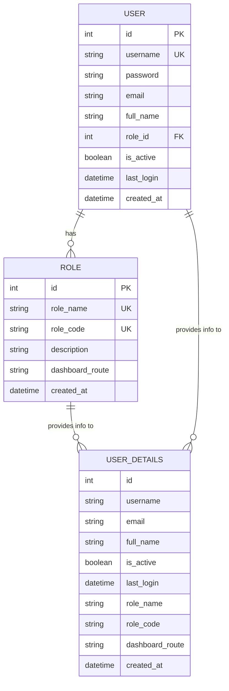

# Data Persistence - CSR System

## Overview
The CSR System uses **Supabase (PostgreSQL)** for data persistence, implementing a relational database model with proper normalization, constraints, and indexes.

---

## 1. Conceptual Data Model

### Entity-Relationship Diagram



---

## 2. Logical Data Model

### Entities and Attributes

#### 2.1 Role Entity
**Purpose**: Define user roles and their permissions

| Attribute | Type | Constraints | Description |
|-----------|------|-------------|-------------|
| id | SERIAL | PRIMARY KEY | Unique identifier |
| role_name | VARCHAR(50) | UNIQUE, NOT NULL | Display name of role |
| role_code | VARCHAR(20) | UNIQUE, NOT NULL | Code for programmatic access |
| description | TEXT | NULL | Description of role |
| dashboard_route | VARCHAR(100) | NOT NULL | Frontend route for role |
| created_at | TIMESTAMP | DEFAULT NOW() | Creation timestamp |

**Business Rules**:
- Each role has a unique name and code
- Role code used in authentication and authorization
- Dashboard route determines where user is redirected after login

---

#### 2.2 User Entity
**Purpose**: Store user account information

| Attribute | Type | Constraints | Description |
|-----------|------|-------------|-------------|
| id | SERIAL | PRIMARY KEY | Unique identifier |
| username | VARCHAR(50) | UNIQUE, NOT NULL | Login username |
| password | TEXT | NOT NULL | Hashed password (bcrypt) |
| email | VARCHAR(100) | NULL | User email address |
| full_name | VARCHAR(100) | NOT NULL | Full display name |
| role_id | INTEGER | FK → roles(id), NOT NULL | Reference to role |
| is_active | BOOLEAN | DEFAULT TRUE | Account status |
| last_login | TIMESTAMP | NULL | Last successful login |
| created_at | TIMESTAMP | DEFAULT NOW() | Account creation date |

**Business Rules**:
- Username must be unique
- Password must be hashed before storage
- is_active=FALSE prevents login (soft delete)
- last_login updated on successful authentication

---

#### 2.3 User_Details View
**Purpose**: Simplified query interface with joined data

| Attribute | Type | Source | Description |
|-----------|------|--------|-------------|
| id | INT | users.id | User identifier |
| username | VARCHAR | users.username | Login username |
| email | VARCHAR | users.email | User email |
| full_name | VARCHAR | users.full_name | Full name |
| is_active | BOOLEAN | users.is_active | Account status |
| last_login | TIMESTAMP | users.last_login | Last login time |
| role_name | VARCHAR | roles.role_name | Role display name |
| role_code | VARCHAR | roles.role_code | Role code |
| dashboard_route | VARCHAR | roles.dashboard_route | Dashboard URL |
| created_at | TIMESTAMP | users.created_at | Creation date |

**Purpose**:
- Eliminates need for repeated JOINs in application code
- Improves query performance
- Simplifies controller logic

---

## 3. Physical Data Model (PostgreSQL)

### 3.1 Table: roles

```sql
CREATE TABLE roles (
    id SERIAL PRIMARY KEY,
    role_name VARCHAR(50) UNIQUE NOT NULL,
    role_code VARCHAR(20) UNIQUE NOT NULL,
    description TEXT,
    dashboard_route VARCHAR(100) NOT NULL,
    created_at TIMESTAMP DEFAULT NOW()
);
```

**Indexes**:
- Primary key index on `id` (automatic)
- Unique index on `role_name` (automatic)
- Unique index on `role_code` (automatic)

**Initial Data**:
```sql
INSERT INTO roles (role_name, role_code, description, dashboard_route) VALUES
('User Admin', 'USER_ADMIN', 'System administrator with full access', '/dashboard/admin'),
('PIN', 'PIN', 'Product Innovation Narrator', '/dashboard/pin'),
('CSR Rep', 'CSR_REP', 'Customer Service Representative', '/dashboard/csr'),
('Platform Management', 'PLATFORM_MGMT', 'Platform management team', '/dashboard/platform');
```

---

### 3.2 Table: users

```sql
CREATE TABLE users (
    id SERIAL PRIMARY KEY,
    username VARCHAR(50) UNIQUE NOT NULL,
    password TEXT NOT NULL,
    email VARCHAR(100),
    full_name VARCHAR(100) NOT NULL,
    role_id INTEGER NOT NULL REFERENCES roles(id),
    is_active BOOLEAN DEFAULT TRUE,
    last_login TIMESTAMP,
    created_at TIMESTAMP DEFAULT NOW()
);

CREATE INDEX idx_users_username ON users(username);
CREATE INDEX idx_users_role_id ON users(role_id);
```

**Indexes**:
- Primary key index on `id` (automatic)
- Unique index on `username` (automatic)
- Non-unique index on `username` (for faster lookups)
- Non-unique index on `role_id` (for JOIN optimization)

**Foreign Keys**:
- `role_id` → `roles(id)` (CASCADE not specified, protect roles)

---

### 3.3 View: user_details

```sql
CREATE OR REPLACE VIEW user_details AS
SELECT 
    u.id,
    u.username,
    u.email,
    u.full_name,
    u.is_active,
    u.last_login,
    r.role_name,
    r.role_code,
    r.dashboard_route,
    u.created_at
FROM users u
JOIN roles r ON u.role_id = r.id;
```

**Benefits**:
- Pre-joins user and role data
- Simplifies SELECT queries
- Improves code readability
- Encapsulates JOIN logic

---

## 4. Database Constraints

### Primary Key Constraints
- `roles.id`: Ensures unique role identifier
- `users.id`: Ensures unique user identifier

### Unique Constraints
- `roles.role_name`: No duplicate role names
- `roles.role_code`: No duplicate role codes
- `users.username`: No duplicate usernames

### Foreign Key Constraints
- `users.role_id → roles.id`: Referential integrity
  - Ensures every user has a valid role
  - Prevents deletion of roles with assigned users (default RESTRICT behavior)

### Check Constraints
None currently defined. Future enhancements could include:
- Email format validation
- Password length requirements (enforced in application)

### Not Null Constraints
- `roles.role_name`, `roles.role_code`, `roles.dashboard_route`
- `users.username`, `users.password`, `users.full_name`, `users.role_id`

---

## 5. Data Access Patterns

### 5.1 Authentication (Login)
```sql
-- Get user with role information
SELECT * FROM user_details 
WHERE username = ? AND role_code = ?;

-- Get password for verification
SELECT password FROM users WHERE username = ?;

-- Update last login
UPDATE users SET last_login = NOW() WHERE id = ?;
```

### 5.2 User Management (CRUD)

#### Create User
```sql
-- Check username availability
SELECT id FROM users WHERE username = ?;

-- Insert new user
INSERT INTO users (username, password, full_name, email, role_id, is_active)
VALUES (?, ?, ?, ?, ?, TRUE)
RETURNING *;
```

#### Read User
```sql
-- Get single user with role
SELECT * FROM user_details WHERE id = ?;

-- Get all users
SELECT * FROM user_details ORDER BY id;
```

#### Update User
```sql
UPDATE users 
SET full_name = ?, email = ?, role_id = ?, is_active = ?
WHERE id = ?
RETURNING *;
```

#### Suspend User (Soft Delete)
```sql
UPDATE users 
SET is_active = FALSE
WHERE id = ?;
```

### 5.3 Search Users
```sql
-- Search by username
SELECT * FROM user_details WHERE username ILIKE '%' || ? || '%';

-- Search by full name
SELECT * FROM user_details WHERE full_name ILIKE '%' || ? || '%';

-- Search by email
SELECT * FROM user_details WHERE email ILIKE '%' || ? || '%';
```

### 5.4 Role Management
```sql
-- Get all roles
SELECT * FROM roles ORDER BY id;
```

---

## 6. Performance Optimization

### Indexes
1. **Primary Keys**: Automatic B-tree indexes for fast lookups
2. **Unique Constraints**: Automatic indexes for username, role_code, role_name
3. **Foreign Keys**: Index on `users.role_id` for efficient JOINs
4. **Additional Index**: `idx_users_username` for login queries

### Views
- `user_details` view pre-computes JOIN, reducing query complexity
- Views are not materialized, so always return current data

### Query Optimization
- Use of indexes for WHERE clauses
- Selective column retrieval (avoid SELECT *)
- Parameterized queries to prevent SQL injection and enable query plan caching

---

## 7. Data Integrity

### Referential Integrity
- Foreign key `users.role_id` ensures valid role assignment
- Cannot delete role with assigned users (RESTRICT behavior)

### Domain Integrity
- Data types enforce valid values
- NOT NULL constraints prevent missing required data
- UNIQUE constraints prevent duplicates

### Entity Integrity
- Primary keys ensure unique identification
- Serial IDs automatically generated

---

## 8. Security Considerations

### Password Storage
- **Never store plain text passwords**
- All passwords hashed using bcrypt with salt
- Hash stored in `users.password` column (TEXT type)
- Application layer handles hashing/verification

### Data Access
- Application uses service account credentials
- Row-level security (RLS) not currently implemented
- Future: Consider RLS for multi-tenant scenarios

### Audit Trail
Current: `created_at`, `last_login` timestamps
Future enhancements:
- `updated_at` timestamp
- Audit table for tracking changes
- Soft delete tracking (deleted_at, deleted_by)

---

## 9. Backup and Recovery

### Supabase Automatic Backups
- Daily automated backups
- Point-in-time recovery available
- Backup retention based on plan

### Manual Backup
```bash
pg_dump -h <supabase-host> -U <username> -d <database> > backup.sql
```

### Restore
```bash
psql -h <supabase-host> -U <username> -d <database> < backup.sql
```

---

## 10. Data Migration Strategy

### Schema Changes
1. Create migration script
2. Test in development environment
3. Apply to production with backup
4. Verify data integrity

### Example Migration: Add Column
```sql
-- Add new column
ALTER TABLE users ADD COLUMN phone VARCHAR(20);

-- Set default for existing rows
UPDATE users SET phone = NULL WHERE phone IS NULL;
```

### Example Migration: Modify Constraint
```sql
-- Add new constraint
ALTER TABLE users ADD CONSTRAINT email_format 
CHECK (email ~* '^[A-Za-z0-9._%+-]+@[A-Za-z0-9.-]+\.[A-Z|a-z]{2,}$');
```

---

## 11. Scalability Considerations

### Current Scale
- Small to medium user base (< 10,000 users)
- Simple schema with minimal JOINs
- Adequate performance with current indexes

### Future Scaling Options
1. **Vertical Scaling**: Increase Supabase tier for more resources
2. **Read Replicas**: Separate read and write operations
3. **Caching**: Implement Redis for frequently accessed data
4. **Partitioning**: Partition users table if it grows very large
5. **Archiving**: Move inactive users to archive table

---

## 12. Sample Data

### Roles
| id | role_name | role_code | dashboard_route |
|----|-----------|-----------|----------------|
| 1 | User Admin | USER_ADMIN | /dashboard/admin |
| 2 | PIN | PIN | /dashboard/pin |
| 3 | CSR Rep | CSR_REP | /dashboard/csr |
| 4 | Platform Management | PLATFORM_MGMT | /dashboard/platform |

### Users (Sample)
| id | username | full_name | email | role_id | is_active |
|----|----------|-----------|-------|---------|-----------|
| 1 | admin | System Administrator | admin@company.com | 1 | TRUE |
| 2 | pin_user | John Innovation | pin@company.com | 2 | TRUE |
| 3 | csr_rep | Jane Support | csr@company.com | 3 | TRUE |
| 4 | platform_mgr | Mike Manager | platform@company.com | 4 | TRUE |

---

## 13. Database Connection

### Supabase Configuration
```python
# Python (Backend)
from supabase import create_client
import os

supabase_url = os.getenv("SUPABASE_URL")
supabase_key = os.getenv("SUPABASE_KEY")
supabase = create_client(supabase_url, supabase_key)
```

### Environment Variables
```
SUPABASE_URL=https://your-project.supabase.co
SUPABASE_KEY=your-anon-key
```

---

## 14. Query Performance Metrics

### Expected Performance (Small Dataset)
- Login query: < 50ms
- User list retrieval: < 100ms
- Single user lookup: < 20ms
- Search query: < 150ms
- User creation: < 100ms

### Monitoring
- Use Supabase dashboard for query performance
- Monitor slow queries
- Analyze query plans for optimization

---

## 15. Data Validation

### Application-Level Validation
- Username: 3-50 characters, alphanumeric
- Password: Minimum 8 characters (enforce in UI)
- Email: Valid email format
- Role ID: Must exist in roles table

### Database-Level Validation
- Data types (VARCHAR length, INT range)
- NOT NULL constraints
- UNIQUE constraints
- Foreign key constraints

---

## Conclusion

The CSR System's data persistence layer provides:
- ✅ Normalized relational schema
- ✅ Proper constraints and integrity
- ✅ Optimized indexes for performance
- ✅ Secure password storage
- ✅ Scalable architecture
- ✅ Clear data access patterns

The schema supports all current requirements and is designed for future growth.

---

_For complete system documentation, see:_
- `USE_CASE_DESCRIPTIONS.md`
- `SEQUENCE_DIAGRAMS.md`
- `BCE_CLASS_DIAGRAM.md`
