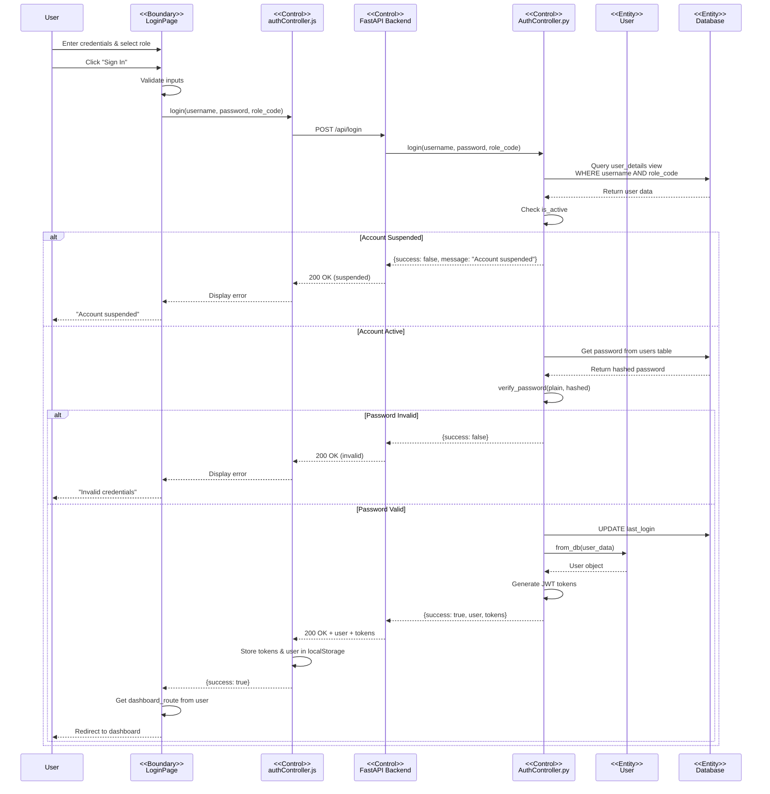
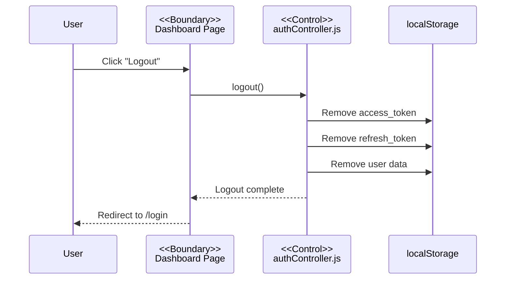
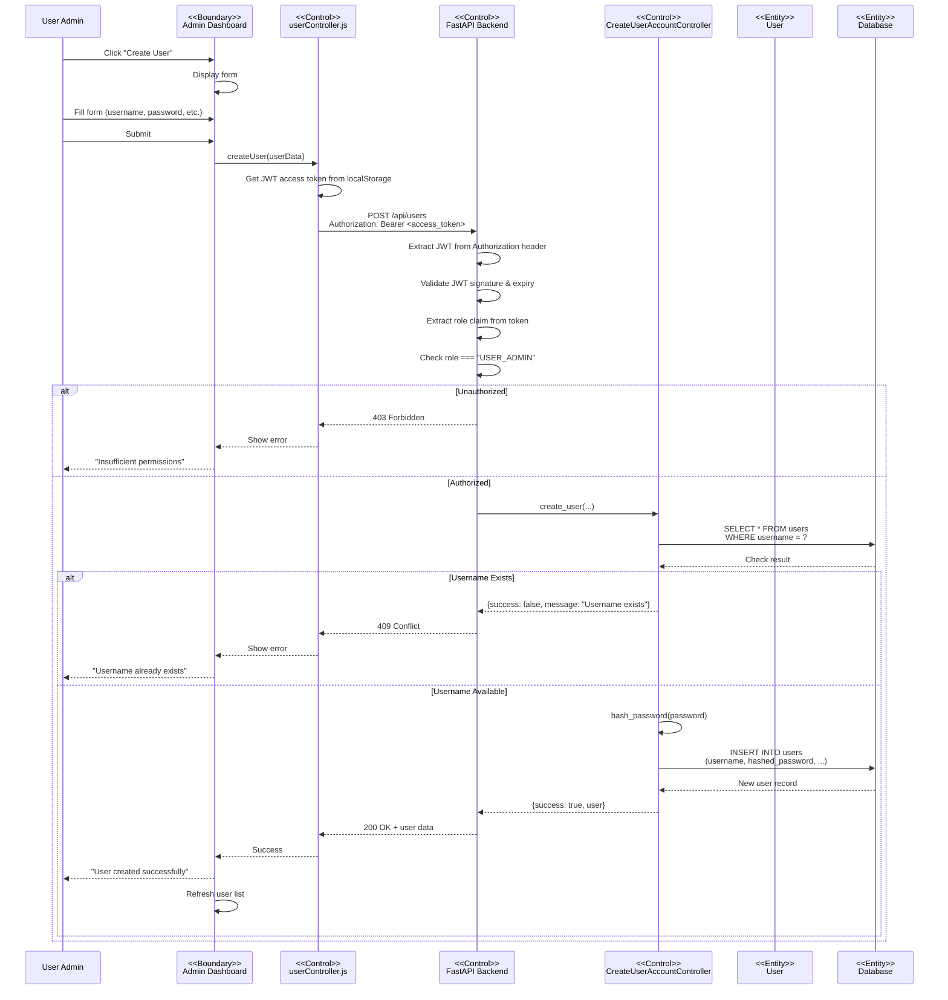
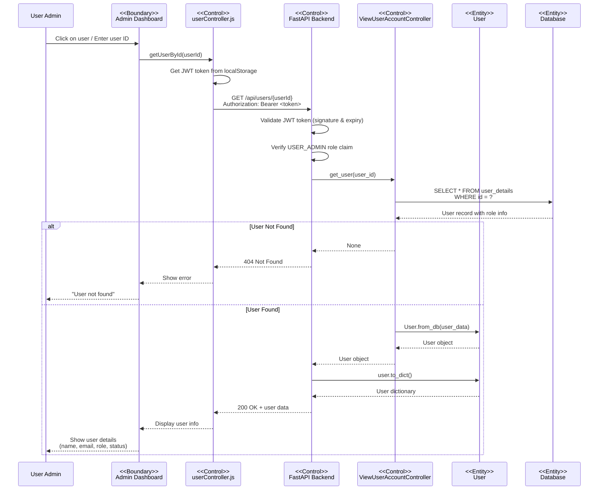
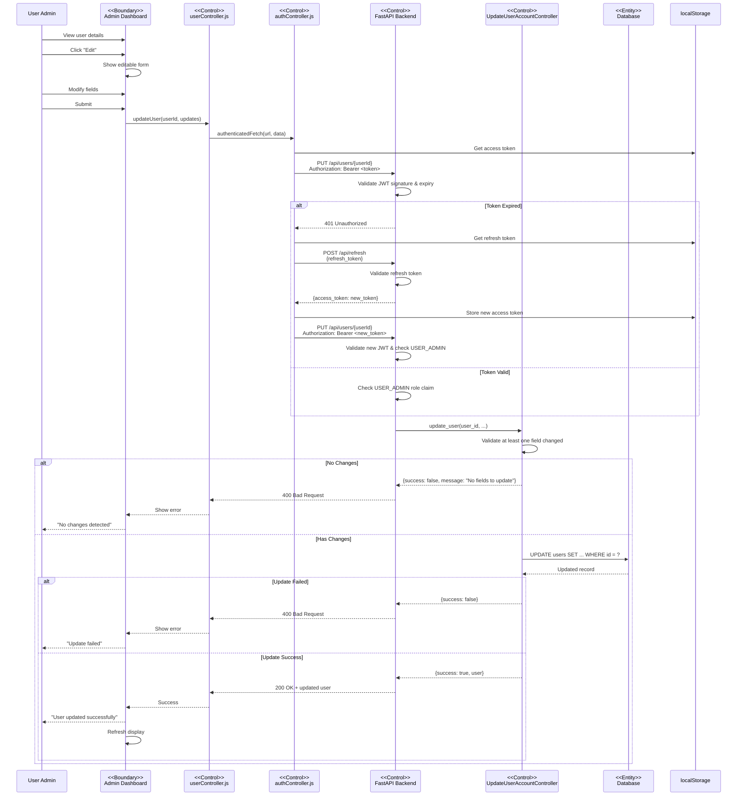
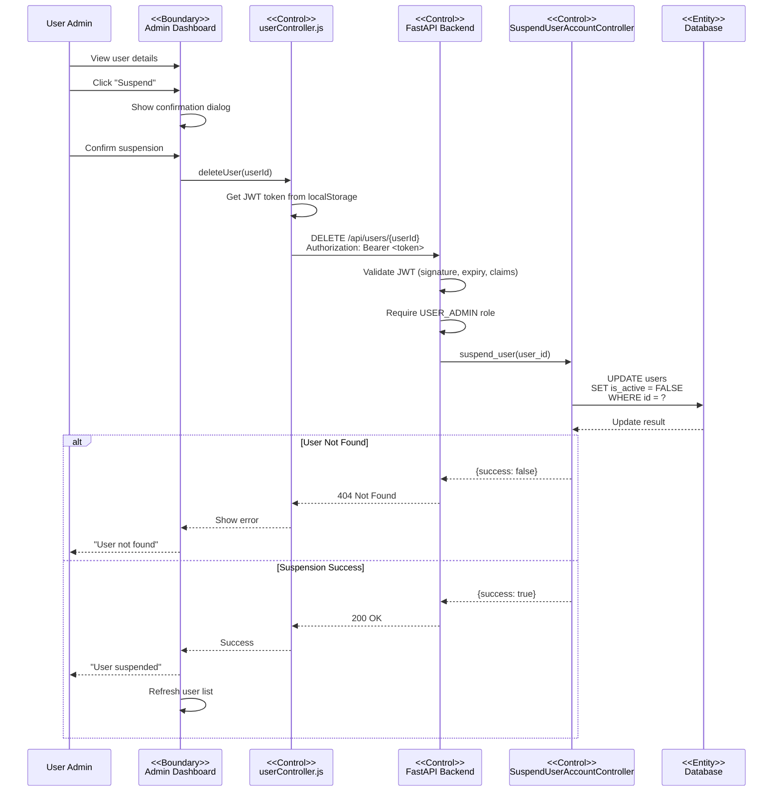
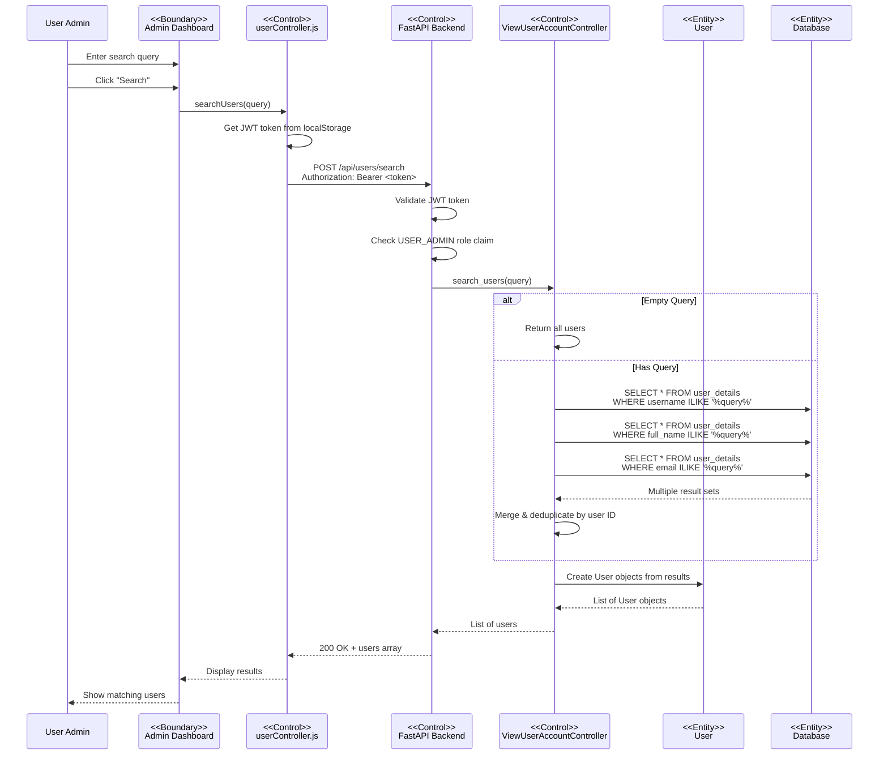
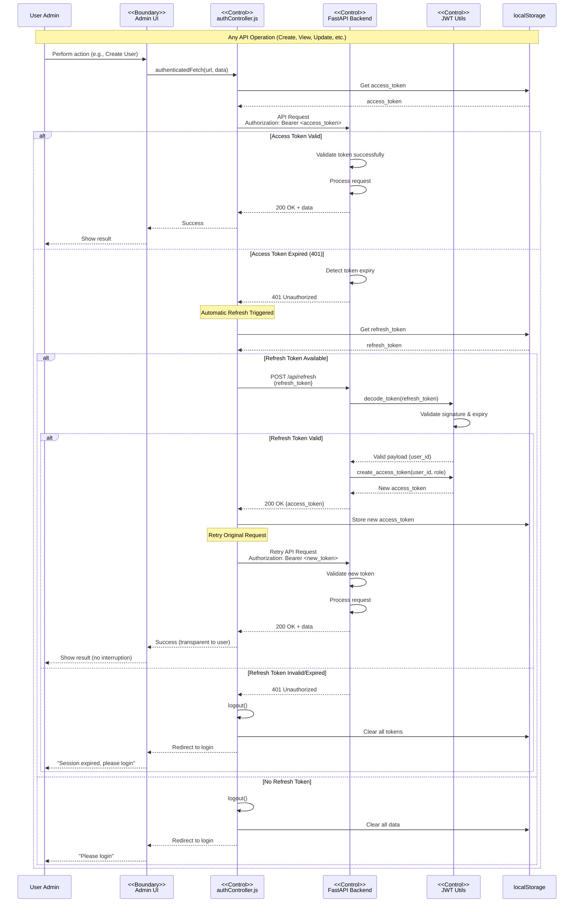

# Sequence Diagrams - CSR System (BCE Framework)

All sequence diagrams follow the BCE (Boundary-Control-Entity) architectural pattern.

## Table of Contents
1. [Login Sequence](#1-login-sequence-diagram)
2. [Logout Sequence](#2-logout-sequence-diagram)
3. [Create User Account with JWT](#3-create-user-account-sequence-with-jwt-authentication)
4. [View User Account with JWT](#4-view-user-account-sequence-with-jwt-authentication)
5. [Update User Account with Token Refresh](#5-update-user-account-sequence-with-automatic-token-refresh)
6. [Suspend User Account with JWT](#6-suspend-user-account-sequence-with-jwt-authentication)
7. [Search Users with JWT](#7-search-users-sequence-with-jwt-authentication)
8. [Token Refresh Mechanism](#8-automatic-token-refresh-mechanism)

---

## 1. Login Sequence Diagram

**Key Points**:
- BCE layers clearly separated
- Password verification uses bcrypt
- Role-based routing to dashboards
- JWT tokens issued on successful login

---

## 2. Logout Sequence Diagram

**Key Points**:
- Client-side operation only
- Clears all authentication data
- Stateless JWT doesn't require server-side invalidation

---

## 3. Create User Account Sequence (with JWT Authentication)

**Key Points**:
- **JWT token required in Authorization header**
- **Token validation: signature, expiry, and role claim**
- **Role-based authorization: Only USER_ADMIN allowed**
- Password hashing with bcrypt before storage
- Username uniqueness validation
- Entity created in database

---

## 4. View User Account Sequence (with JWT Authentication)

**Key Points**:
- **JWT token validated before data retrieval**
- **Role-based access control via token claims**
- Uses user_details view for joined data
- Entity object created from DB data
- Sensitive data (password) not returned

---

## 5. Update User Account Sequence (with Automatic Token Refresh)

**Key Points**:
- **Demonstrates automatic token refresh on expiry**
- **Frontend detects 401 and refreshes token transparently**
- **User experience uninterrupted during token refresh**
- Only modified fields are updated
- Role validation required via JWT claims
- Entity persistence in database

---

## 6. Suspend User Account Sequence (with JWT Authentication)

**Key Points**:
- **JWT token authentication required**
- **Only USER_ADMIN role authorized**
- Soft delete (is_active flag)
- **Suspended user cannot login (fails UC-001 step 11)**
- **Suspended user's existing tokens remain valid until expiry**
- Confirmation required
- User record preserved in database

---

## 7. Search Users Sequence (with JWT Authentication)

**Key Points**:
- **JWT authentication on search operations**
- **Token validated before query execution**
- Case-insensitive search (ILIKE)
- Searches multiple fields
- Deduplicates results
- Entity objects created from search results

---

## 8. Automatic Token Refresh Mechanism

This mechanism is integrated into all user management operations (UC-003 through UC-008) to ensure uninterrupted access when the access token expires.

**Key Points**:
- **Fully automatic** - user never sees session expiry
- **Transparent refresh** - happens in background
- **60-minute access tokens** - short-lived for security
- **7-day refresh tokens** - longer session duration
- **Graceful fallback** - logout if refresh fails
- **Integrated into all operations** - consistent across UC-003 to UC-008

**Token Lifecycle**:
1. **Login** (UC-001): Both tokens created
2. **First 60 minutes**: Access token used directly
3. **After 60 minutes**: Access token expires
4. **Auto-refresh**: New access token obtained using refresh token
5. **Continue**: Operations proceed without user noticing
6. **After 7 days**: Refresh token expires, user must re-login

**Security Benefits**:
- Short-lived access tokens minimize exposure
- Refresh token required for renewal
- Invalid/expired refresh tokens force re-authentication
- Stateless tokens enable horizontal scaling

---

## BCE Architecture Summary

### Boundary Layer (Frontend)
- **Components**: LoginPage, Dashboards, Forms
- **Controllers**: authController.js, userController.js
- **Responsibilities**: UI, user input, API calls, state management

### Control Layer (Backend)
- **FastAPI**: Routes, middleware, validation
- **Controllers**: AuthController, CreateUserAccountController, ViewUserAccountController, UpdateUserAccountController, SuspendUserAccountController
- **Responsibilities**: Business logic, authorization, coordination

### Entity Layer (Data)
- **Models**: User, Role, AuthResponse
- **Database**: Supabase PostgreSQL (users, roles, user_details view)
- **Responsibilities**: Data representation, persistence

---

## Technology Stack

- **Frontend**: Next.js 14, React, Tailwind CSS
- **Backend**: Python 3.10+, FastAPI, Uvicorn
- **Database**: Supabase (PostgreSQL)
- **Authentication**: JWT (PyJWT), bcrypt
- **Architecture**: BCE (Boundary-Control-Entity)

---

_For detailed use cases, class diagrams, and data schemas, see:_
- `USE_CASE_DESCRIPTIONS.md`
- `BCE_CLASS_DIAGRAM.md`
- `DATA_PERSISTENCE.md`
